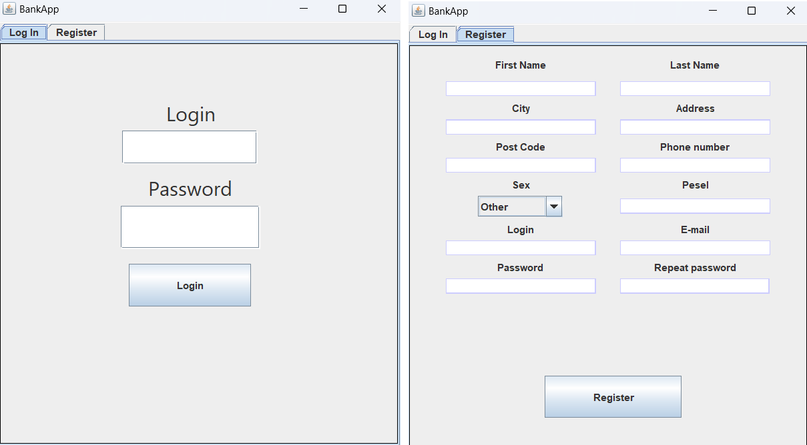

# BankApp
<i> Product Version: Apache NetBeans IDE 16 </i>
 
<i> Java Version: 19.0.1 </i>
 
<i> Runtime: Java(TM) SE Runtime Environment 19.0.1+10.21 </i>
 
<i> Maven Version: 3.8.6 </i>

<h1> An application that simulates a bank account, allowing you to set up a new account and manage it after logging in to the account panel. </h1>

<h3> When launched, the application will display a window with two panels. The first "Login" panel allows you to log in to an existing account. </h3>

<h3> The second panel "Register" allows you to create a new account. To do this, each field must be filled in, and some fields should meet certain conditions.</h3>
<h3> The conditions that must be met are: </h3>
<ul>
	<li> Login must be longer than 7 </li>
	<li> PostCode must contain exactly 5 digit </li>
	<li> Phone Number must contain exactly 9 digits </li>
	<li> Email must be valid </li>
	<li> Pesel must contain exactly 11 digits </li>
	<li> Password and rePassword must be the same </li>
	<li>  Password must contain:
		<ul>
			<li> At least one uppercase and one lowercase letter </li>
			<li> At least one number </li>
			<li> At least one special character </li>
			<li> Must be longer than 7 </li>
		</ul>
	</li>
</ul>

<h3> When all the data in the fields are correct, the account will be created. </h3>

 

<h3> After creating an account in the login panel, you can log in to the previously created account using your login and password. </h3>

<h3> If there is an account with the entered login and password, a new window with account details will appear. The account panel shows your account balance, account information, and five buttons.</h3>

 

<h3> The first two buttons "Deposit money" and "Withdraw money" allow you to deposit and withdraw money from your account. When you click on one of these buttons, a special window will appear telling you how much money you want to deposit or withdraw. In the case of a withdrawal, it must be equal to or less than the account balance, otherwise the money will not be withdrawn and the message "Not enough money to withdraw" will appear below the value in the field.</h3>

 

<h3> The next button is "Change Password". After clicking, a window with three fields will appear: "old password", "new password" and "reply to new password". </h3>
<h3> The new password must meet all the conditions as when creating an account, and the new password cannot be the same as the old password.</h3>
<h3> If all fields are correct, the password will be changed and you will have to use the new password the next time you log in. </h3>

 

<h3> The next button is "Logout", which allows you to log out of your account and return to the start panel. </h3>

<h3> The last button "Delete Account" allows you to delete an existing account. After clicking, a window will appear in which the user must fill in the PESEL and password fields. When all the data is correct, after clicking the "Delete" button, another panel will appear with the question "Are you sure you want to delete the account?". If you select "yes", the account will be deleted and the application will be closed. </h3>

 

<h3> All data is stored in the "accounts.json" file, which is saved and loaded thanks to the Gson library, which allows you to easily process data from java into a Json file. </h3>

